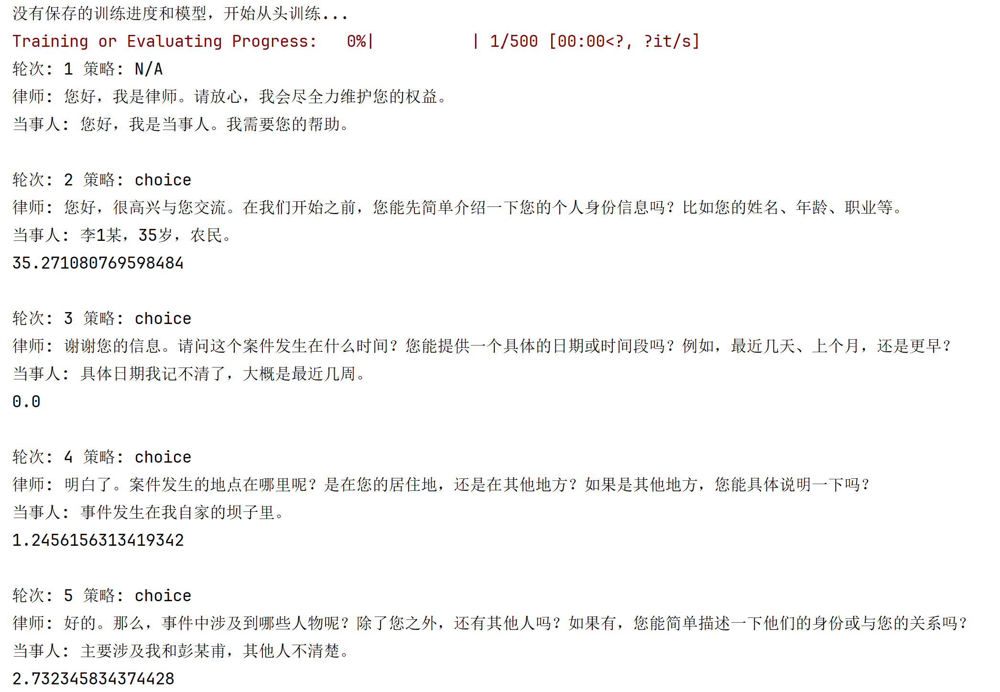

# 项目名称：基于深度强化学习的律师与嫌疑人对话策略选择
这是一个基于强化学习的对话策略选择项目，主要用于律师与嫌疑人之间的对话模拟，通过深度强化学习算法优化策略选择。
## 功能描述：
1、强化学习环境：Lawyer-Suspector-Env 文件夹中定义了一个模拟律师与嫌疑人对话的环境。

2、深度强化学习算法：支持DQN和PPO算法，用于优化对话策略选择。

3、奖励函数：自定义奖励函数模块（reward_calculator.py 和 reward_calculator_2.py），提供多样化的奖励计算逻辑。

4、提示工程：通过提示模板（存储于 prompt/ 文件夹）指导大模型生成模拟对话。

5、数据库支持：通过 DB.py 模块操作案件信息数据库（SQL文件为 law_data_total.sql）。

## 项目结构：
```plaintext
RL_PolicyChoose/
├── dialogue/                              # 存储对话记录(json格式)的文件夹
├── Lawyer-Suspector-Env/                  # 自定义强化学习环境文件夹
│   ├── env_register.py                    # 环境注册脚本
│   └── lawyer-suspector-env.py            # 律师-嫌疑人对话环境定义
├── paraphrase-xlm-r-multilingual-v1/      # 预训练的句子嵌入模型
├── prompt/                                # 提示工程相关文件
│   ├── policy_prompt.json                 # 策略提示词模板
│   ├── evaluator.txt                      # 评估提示词模板
│   ├── lawyer_prompt.txt                  # 律师提示词模板
│   ├── restore_information.txt            # 案件信息提取提示词模板
│   └── suspector_prompt.txt               # 嫌疑人提示模板
├── README.md                              # 项目说明文档
├── agent.py                               # 大模型相关智能体定义
├── DB.py                                  # 数据库操作模块
├── DQN.py                                 # DQN算法实现
├── PPO.py                                 # PPO算法实现
├── reward_calculator.py                   # 奖励计算逻辑1，基于大模型
├── reward_calculator_2.py                 # 奖励计算逻辑2，基于向量相似度
├── law_data_total.sql                     # 案件信息、对话记录存储的SQL文件
└── requirement.txt                        # 项目依赖库列表
``````

## 正确运行示例
